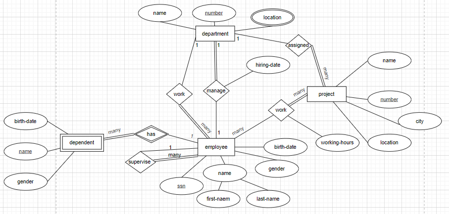
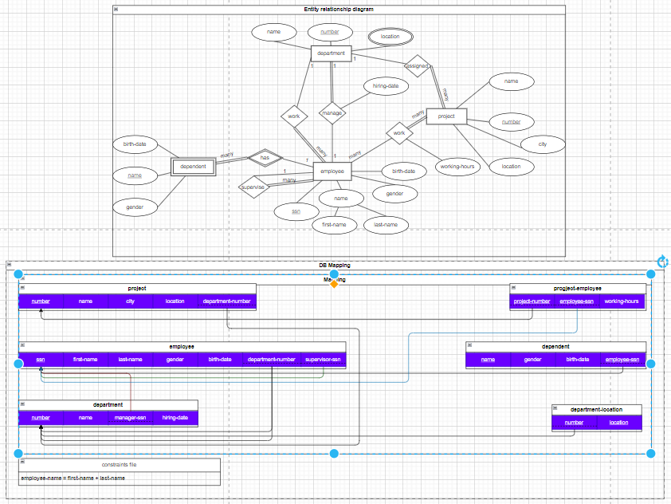

# DB Mapping exercis

Here we will convert our last work **ERD** that we designed for a componet, we now will try to convert it into DB schema, In another word we will make a **DB Mapping**.

## Here our resources

[Entity-relationship Diagram](./design/last-exercise-answer.drawio)  

## Answer
Because we are lucky the lessong [DB Mapping](../db-mapping/db-mapping.md) is already give for us steps we can follow to make the **DB Schema**. So below just the answer.  
[Entity-relationship Diagram](./design/exercise-answer.drawio)
