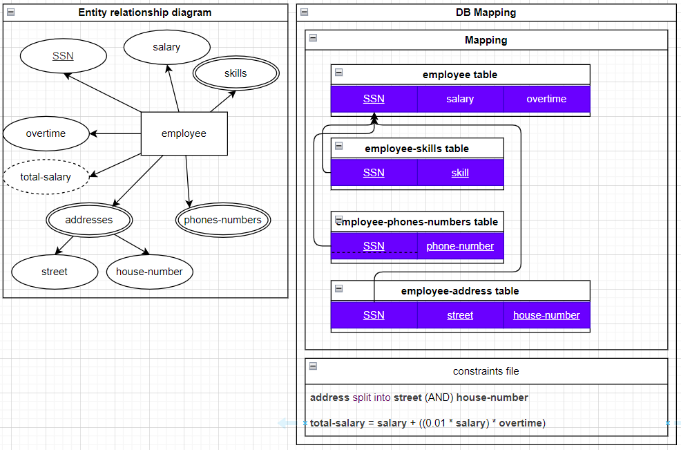

# DB Mapping
- Is a set of rules that applied to the **ERD** to get the db tables schema.
- The only cardinality of the relation between tables in the DB is: **One to Many**. The **one** in the realtion represent what we  called **parent table**, and the many is a **child table**.
- Can't delete a record of the **parent table** that have children in the **child table**.

## Forgin key
- It's a primary key of another table.
- Relatihonships between enities is translated to a **foregin key** in one of the entities that participate in the relation.
- Foregin key can be **null** if the relation is **partial participation**.
- When drawing the **forgin key field** in the table schema diagram, the draw an arrow from the **forgin key** to it's **PK**. And the arrow head is point to the **PK**, And put dashed underline for the **forgin key**.

## DB
- A **DB Server** is a collection of *databases*.
- A **Database (DB)** contains *schemas*.
- A **Schema** contains *objects* (such as *tables*).
- An **Object** (*Table*) is a collection of *attributes* (columns or fields) and *rows* (records or tuples).
- An **Attribute** is a characteristic (property) of an *entity*.
- A **Row** (*Record or Tuple*) represents the specific values for an instance of an *entity*.

### Attributes (columns)
Every **column** in a DB must have a domain (specific range of values); we achieve that by set a *data type* for each *column*.  
The **Data Type** can determin 2 things:
1. The *quality* of the data: It is mean data type like (integer, string, boolean, ...)
2. The *size* of the data: For each *data type* a specific number of *bits* that data store in, and this size of bit is determin the range of values that *data type* provide.
    - For example in sql there is a data type called **tinyint**, it store the *data* as integer in 8 *bits* or what we caled 1 *byte*; bacause of it's size (1B), it accept inegers just in range between -128 to 127.
Every **column** need to have a *constrains* and *rules* must added to store the data more accurately. For **example** if I want to store the age of *student*, so the *age* attribute can't be *negative* value, or maybe at specific range like between 20 to 40.

## Steps
These are the recommended steps from experts in **DB Mapping**:  
0. If there any total participation from 2 sides of a binary relationship (1:1). (you need to solve it firstly (*Note*: You will find the solution in the **step 3 => case 1**)).
1. Mapping of regulare (strong) entity type.
2. Mapping of weak entity types.
3. Mapping of binary relationship (1:1) types.
4. Mapping of binary relationship (1:N) types.
5. Mapping of binary relationship (M:N) types.
6. Mapping of N-ary relationship types.
7. Mapping of Unary relationship.

### 1. Mapping of reqular (strong) entity type
1. Convert each regular (strong) entity to a table.
2. The **primary key** of the table will be the **primary key** of the *strong entity*.  
3. Mapping the attributes accourding to *Mapping the attriubtes* section.

[Here is an example of **Mapping ERD to DB schema**](./design/strong-entity-mapping.drawio).  
  

### 2. Mapping of weak entity type
1. Convert each weak entity to a table.
2. We know that the **PK** of a weak entity is called a **partial key** because weak entity is weak because it dependent on **strong entity**. so when we convert weak entity to a table, you need a reference to the **strong entity**; So that the **PK** of the table of the weak entity is a **composite key**: It's a compination of the **Partial key** of the weak entity and the **FK** that refere to the **PK** of the strong entity.
3. Mapping the attributes accourding to *Mapping the attriubtes* section.

[Here is an example of **Mapping ERD to DB schema**](./design/weak-entity-mapping.drawio).  
  

### 3. Mapping of binary relationship (1:1) types
There are 3 cases for mapping of binary relationships (1:1)
#### Case 1: When the relationship is totaly participation from the 2 sides.
1. Convert the 2 entities to one table.
2. The **PK** of the new table, will be any **PK** of the 2 entities.
3. Mapping the attributes accourding to *Mapping the attributes that connect with the binary realtionships* section.  

[Here is an example of **Mapping ERD to DB schema**](./design/totaly-participation-one-to-one.drawio).  
  

#### Case 2: When the relationship is totaly participation from a 1 side.
1. Convert the 2 entities to 2 tables.
2. The **PK** of the 2 tables is the **PK** of the entity.
3. For the entity with the **total** participation add **FK** that refare to the **PK** of the entitiy with the **partial** participation in the relationship.
4. Mapping the attributes accourding to *Mapping the attributes that connect with the binary realtionships* section.  

[Here is an example of **Mapping ERD to DB schema**](./design/totaly-participation-one-to-one-for-one-side.drawio).  
  

#### Case 3: When the relationship is partialy participation from the 2 sides.
1. Convert the 2 entities to 2 tables.
2. The **PK** of the 2 tables is the **PK** of the entity.
3. Create new table that has 2 columns, the 2 columns are the *PK* of the 2 tables that present the 2 entities.
4. The **PK** of the new table is any one of the 2 columns.
5. Mapping the attributes accourding to *Mapping the attributes that connect with the binary realtionships* section.  

[Here is an example of **Mapping ERD to DB schema**](./design/partialy-participation-one-to-one.drawio).  
  

### 4. Mapping of binary relationship (1:N) types
There are 2 cases for mapping of binary relationships (1:N)
#### Case 1: When the relationship is totaly participation from the *many* cardinality side.
1. Convert the 2 entities to 2 tables.
2. The **PK** of the 2 tables is the **PK** of the entity.
3. For the entity with the **many** cardinality add **FK** that refare to the **PK** of the entitiy with the **one** cardinality in the relationship.
4. Mapping the attributes accourding to *Mapping the attributes that connect with the binary realtionships* section.  

[Here is an example of **Mapping ERD to DB schema**](./design/totaly-participation-one-to-many-for-many-side.drawio).  
  

#### Case 2: When the relationship is partialy participation from the *many* cardinality side.
1. Convert the 2 entities to 2 tables.
2. The **PK** of the 2 tables is the **PK** of the entity.
3. Create new table that has 2 columns, the 2 columns are the *PK* of the 2 tables that present the 2 entities.
4. The **PK** of the new table is the **PK** of the table of entity with **many** cardinality in the relationship.
5. Mapping the attributes accourding to *Mapping the attributes that connect with the binary realtionships* section.  

[Here is an example of **Mapping ERD to DB schema**](./design/partialy-participation-one-to-many.drawio).  
  

### 5. Mapping of binary relationship (M:N) types
1. Convert the 2 entities to 2 tables.
2. The **PK** of the 2 tables is the **PK** of the entity.
3. Create new table that has 2 columns, the 2 columns are the *PK* of the 2 tables that present the 2 entities.
4. The **PK** of the new table is a **composit key** of the **PK** of the 2 tables in the relation.
5. Mapping the attributes accourding to *Mapping the attributes that connect with the binary realtionships* section.  

[Here is an example of **Mapping ERD to DB schema**](./design/many-to-many.drawio).  
  

### Mapping the attributes that connect with the binary realtionships
1. The attribute that is connect to the binary relationship will be add to the table that contain the both **PKs* of the entities that participate in the relation.
2. Mapping the attributes accourding to *Mapping the attriubtes* section.

### 6. Mapping of N-ary relationship types
1. Convert all entities in the relation to tables.
2. The **PK** of the table is the **PK** of the entities.
3. Create new table contain all the **PK** of the tables that participate in the relation as a *FK* in the new table.
4. Mapping the attributes accourding to *Mapping the attriubtes* section.
5. The **PK** of the new table you need to find it by your self, it maybe **composite** and may you use **artifitial key** if you can't find any **natural key**.

[Here is an example of **Mapping ERD to DB schema**](./design/Nary-relation.drawio).  
  

### 7. Mapping of Unary Relationships (Self-Relationships)

#### Case 1: When the relationship is (1:N)
1. Convert the entity into a table.
2. The **primary key (PK)** of the table will be the **PK** of the entity.
3. Add a **foreign key (FK)** column in the same table that references the **PK** of the same table.
4. Mapping the attributes accourding to *Mapping the attriubtes* section.

[Here is an example of **Mapping ERD to DB schema**](./design/unary-relation-one-to-many.drawio).  
  

#### Case 2: When the relationship is (M:N)
1. Convert the entity into a table.
2. The **PK** of the table will be the **PK** of the entity.
3. Create a **new table** to represent the relationship:
   - The new table will have a **composite primary key**, consisting of two **foreign keys (FKs)** that both reference the **PK** of the original entity.
4. Mapping the attributes accourding to *Mapping the attriubtes* section.

[Here is an example of **Mapping ERD to DB schema**](./design/unary-relation-many-to-many.drawio).  
  

### Mapping the attriubtes
This is a part of the previouse 2 steps, to complate **Mapping** them.
1. The **simple attributes** of the *entity* will be a **column** of the *table*.
2. The **composit attribute** of the *entity* will be ignored and create **column** for each **sup attribute** of  the **composit attribute**.
    - **Note:** when we ignore the **composit attribute** we need to notify the developers about that in file called *constrain*. In *constrain* file we clarify any meaning we lose when we convert the *ERD* to *DB schema*.
    - In the *constrain file* we record that: `composite attribute = simple attribute1 + simple attribute2 + simple attribute(n)` 
3. The **multi-valued attribute** of the *entity* will be in a sperate table, with a **forigen key** that it's *domain* is the **primary keys** in the original table that represent the *entity*.
    - This new table records contain a *composit key*: it's the compination between the *forigen key* and the *value*.
    - For each **forigen key** in general you draw a **arow** from the **forigen key** to the **PK** that **FK** represent. And the **araw head** should be direct to the **PK**. And put dashed underline for the **forgin key**
4. The **derived attriubte** of the *entity* will not present in the schema, we jsut document in the *constrain file* that: `drived attribute = (equation of simple attributes like: simple attriubte1 / simple attriubte2)`. or we just represent it as a *column* in the table and also document the relation of this attributte with others in the *constrain file*. So you can choose any one of the chooices accourding to the cost of the time and spaces and complexity of the operations will be accourding to your system.
5. The **complex attriute** we know that it's a *multi-valued attribute* and in the same time is *composite attribute*; So for that we do the following:
    1. Because it is *multi-valued attribute* we move it to a new table contain 2 thing: **FK** (It's a **PK** of the original table) and the **multi-value attriubte**.
    2. Because it is a *composite attribute* we in the new table remove the **multi-valued attribute** and replace it with the **simple attributes** that the *complex attriute* split into them.
        - *Note:* Now in this new table we have a **composit key** that is a compination of **FK** and all other attributes in the table.