# Entity-Relationship Diagram
Identifies information required by the business by displaying the relevant entities and the relationships between them.  

## ERD components
### Entity
It's any object or component in the system that will build a database for.  

**Requirment Document**: Entity usually present in *requirement document* as **noun**.  

#### Types
##### Strong Entity
This is an independent entity that is not affected by the deletion of the data of another entity. That does not mean that it does not have a relation with other entities, it means that if I delete a record from another entity, the *strong entity* will not delete all records related to the other entity's deleted record.  
**Strong entity** must have a *primary key* (attribute that has a not-null unique value for each instance of the entity).

**Diagram shape**: Every entity drawen as a ***Rectangle*** in **ERD**.

###### Example
Business has employees, who call the clients, to ...  
[Example Diagram](./design/strong-entity.drawio)  
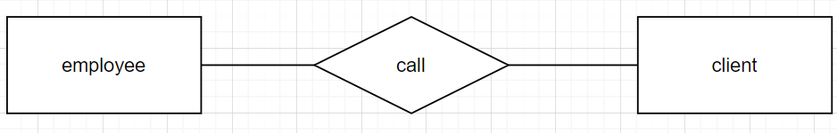  

##### Weak Entity
This is a dependent entity on another entity; So when the other entity ( **Strong entity** ) deletes a record, the weak entity deletes every record related to the deleted **strong entity**.  
The primary key of a *weak entity* is called **Partial key**; because the *weak entity* does not have a value or a meaning in the system without the *strong entity* which it is in relation with.  

**Example** If you have a system of accounts and transactions. If you delete an account, you will delete all transactions related to the deleted account.  

**Diagram shape**: Every weak entity is drawn as a ***2 Nested Rectangles*** in **ERD**, and the relationship between the weak and strong transaction is drawn as a ***2 Nested Diamond***.

###### Example
Business has accounts, each account has/make transactions ...  
[Example Diagram](./design/weak-entity.drawio)  
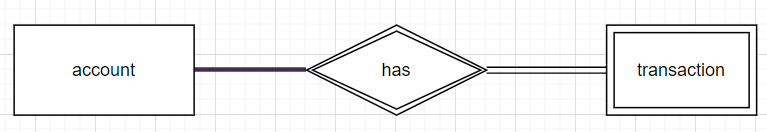  

### Attributes
It's the characteristics of the entity. And no entity without an attribute.  

**Requirment Document**: Atributes usually present in *requirement document* as **noun**.  

*NOTE*: The **relationship** may have an *attribute*; cause if you have 2 entities shared in the same attribute in the context of the relationship, then this attribute is linked to the relationship *diamond* in the **ERD**.  

#### Types
##### Simple Attribute
We call that attribute simple if it:
- Can't split into smaller attributes. *Example:* If a system needs to distribute the client address, it is distributed to counter/city/street, so the **address** attribute in this system is not **Simple**.
- Does not has multiple values. *Example:* If a user has multiple phone numbers in the system so it's not a simple data.
- Can't get by some calculation: *Example*: You can calculate a user **age** if you have thir **birth_date**; so **age** is not simple data.  

**Diagram shape**: Every *simple attribute* drawen as a ***Ellipse*** in **ERD** and connect with its **entity** or **relationship**. [Example Diagram](./design/simple-attribute.drawio)  
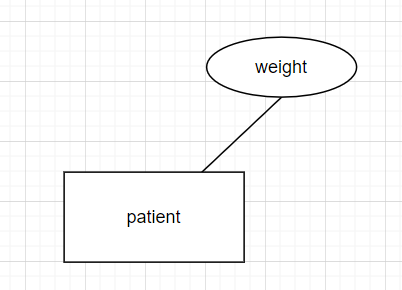  
###### Example
Bussiness has patients, for each patient we record their weight, ...  
[Example Diagram](./design/simple-attribute.drawio)  
  

***Very Important Note:*** There is no standard fixed attribute type for a specific *attribute* that you can assume in all systems; we completely depend on the **Requirement Document** that we get from the **System Analyst**. What I mean is that if you read that: "Every client has a name" from the **Requirement Document**, you can't assume that the client name contains from *first* and *last* name. No, here you should expect it's a simple data, even the user can input a long name. To treat the client name as a combination of 2 parts *first* and *last*, you should read this: "Every client has a first and last name", or anything that gives this meaning. This is not working just here in ***Simple Attributes ***, it works in any part of **ERD**.  

##### Composite Attribute
When an attribute can be split into smaller attributes, and when compose them, you get the original attribute.  

**Diagram shape**: Every *composite attribute* drawen as a ***Ellipse*** in **ERD** and connect with its **entity** or **relationship**, and the *smaller attributes* it split into them.  

###### Example
Business has patients, for each patient we record their first and last name, ...  
[Example Diagram](./design/composite-attribute.drawio)  
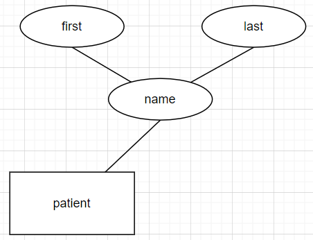  

##### Derived Attribute
When an attribute can be calculated from other attributes.  

**Diagram shape**: Every *derived attribute* drawen as a ***Dashed Ellipse*** in **ERD** and connect with its **entity** or **relationship**.

###### Example
Business has patients, for each patient we record their birth date, age, ...  
*Note:* We can calculate the age of the **patient** from knowing their **birth date**.
[Example Diagram](./design/derived-attribute.drawio)  
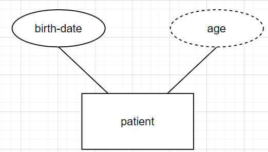  

##### Multi-valued Attribute
When an attribute can has multiple values for the same entity.

**Diagram shape**: Every *multi-value attribute* drawen as a ***Douple Nested Ellipse*** in **ERD** and connect with its **entity** or **relationship**.

###### Example
Business has patients, for each patient we record their phone numbers, which can be more than one...  
[Example Diagram](./design/multi-valued-attribute.drawio)  
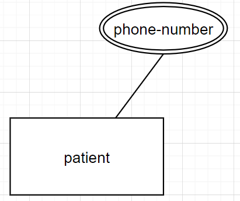  

##### Complex Attribute
When an attribute is a multi-valued attribute, each value for it is a composite attribute.

**Diagram shape**: Every *complex attribute* drawen has 2 levels of attribute:
1. The multi-valued attribute: It is drawn as a *** Double Nested Ellipse*** in **ERD** and connected with its **entity** or **relationship**.
2. The *smaller attributes* that multi-valued attribute split into. And they are drawn as a ***Ellipse*** in **ERD**, and they are connected with the multi-valued attribute they split from.

###### Example
Business has patients, for each patient we record their addresses, and for each address we record the city and the street, ...  
[Example Diagram](./design/complex-attribute.drawio)  
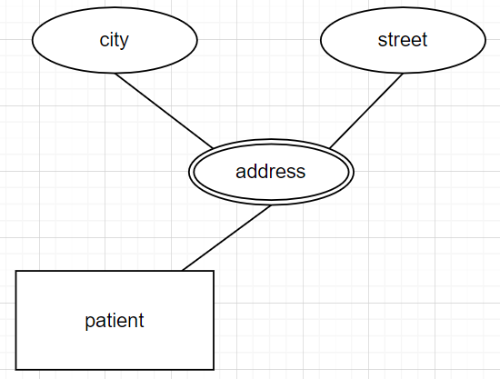  

### Relationships
Link between entities (not attributes, or entities with attributes). And it can be possible to have multiple *relationships* between the same entities (if each relationship has a unique value to the system).

**Requirment Document**: Relationships usually present in *requirement document* as **verps**, like: Customer **has** account. So the relation her is **has**, and the entities are: *customer* and *account*.  

**Diagram shape**: Every relationship drawen as a ***Diamond*** in **ERD**. and connect with its **entities** that share the relation.

#### Degree of relationships
**Degree:** Number of entity types that participate in the relation.

##### Unary (Recursive relationship)
- It is between two instances of one entity type.
- It is a relation between an entity with itself.
- A relationship in which the same entity participates more than once.

**Diagram shape**: **Unary** relationship drawen as a ***Diamond*** in **ERD**. and connect with the same **entity** twice.
###### Example
Business has employees and managers ...  
[Example Diagram](./design/unary-degree-relationship.drawio)  
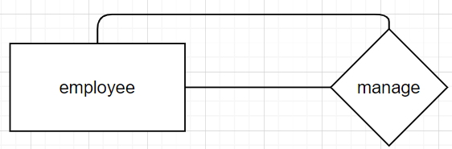  

##### Binary
Between two instances of two entity types.

**Diagram shape**: **Binary** relationship drawen as a ***Diamond*** in **ERD**. and connect with 2 **entities** that share the relation.

###### Example
Business has teachers who teach students...  
[Example Diagram](./design/binary-degree-relationship.drawio)  
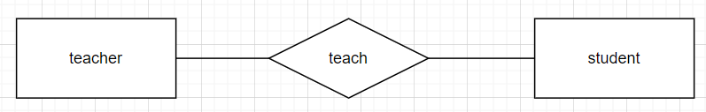  

##### Ternary
- Between three instances of three entity types.
- It's commonly used when there is some attribute I can just get with a relation between 3 entity types.
**Diagram shape**: **Ternary** relationship drawen as a ***Diamond*** in **ERD**. and connect with 3 **entities** that share the relation.

###### Example
Businesses buy products from vendors and store them in warehouses through a shipping method...  
[Example Diagram](./design/ternary-degree-relationship.drawio)  
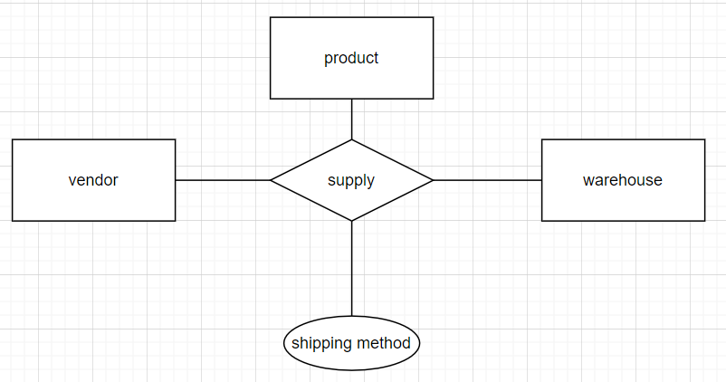  
*Note:* The *ternary degree relation* is not the maximum relation you can have; you may have more degrees, and you can expect how to model them. You just add entities and connect them with the shared relation.  

#### Cardinality
Defines how many instances of one entity can or must be associated with instances of another entity.

##### Types
###### One to One
When one instance of one entity can or must be associated with one instance of another entity.

**Example:**  
Business has a delivery employee, each one has a single car...  
> To know what the cardinality is in this relation, we ask ourselves 2 questions and get 4 values.
> *First question is*: How many cars, one employee have?
> *First question answer*: **1** employee can has **1** car.
> *Second question is*: How many employees can drive the same car?
> *Second quesion answer*: **1** car can be drived by **1** employee.
> Now we take the 1st quantity of the 1st answer and compare it with 2nd quantity of the 2nd answer.
> So we will compar **1** with **1**, and this will give me *1*.
>> ***Important Clarification***
>> The quantities in the answers have just one of these 2 values: *1* **OR** *many*.
>> When we compare 2 quantities of the same value, we get the same value. like *many* compared to *many* it's equal *many*.
>> When we compare *1* with *many* the answer is *many*.
>> If you ask yourself why we have just 2 answers ( *1* **OR** *many* )?
>> The reson that if there a realtion between 2 entities so it's maust at least that there maybe will be a relation between one instance from the 2 sides, so this is the value *1*, so when we have more than *1* even you expect it will be static number like *2* and more, so the relation is *many* the othe value.
> Now we take the 2nd quantity of the 1st answer and compare it with the 1st quantity of the 2nd answer.
> So we will compare **1** with **1**, and this will give me *1*.  
[Example Diagram for the solution with the steps](./design/one-to-one-cardinality.drawio)  
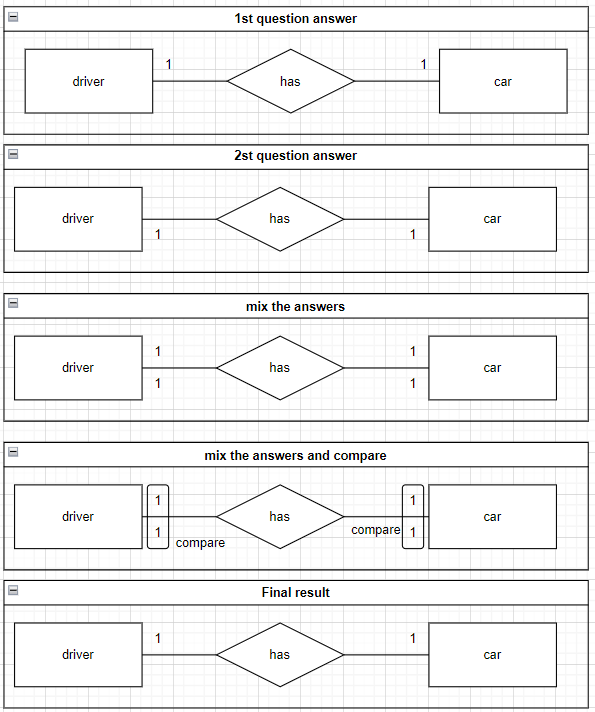  

###### One to Many
When one instance of one entity can or must be associated with many instances of another entity.

**Example:**  
Business has cars, each car can be driven by one or more employees, but no employee can drive more than one car...  
> To know what the cardinality is in this relation, we ask ourselves 2 questions and get 4 values.
> *First question is*: How many cars, one employee drive?
> *First question answer*: **1** employee can drive **1** car.
> *Second question is*: How many employees can drive the same car?
> *Second quesion answer*: **1** car can be drived by **many** employee.
> Now we take the 1st quantity of the 1st answer and compare it with 2nd quantity of the 2nd answer.
> So we will compar **1** with **many**, and this will give me *many*.
> Then we take the 2nd quantity of the 1st answer and compare it with 1st quantity of the 2nd answer.
> So we will compare **1** with **1**, and this will give me *1*.  
[Example Diagram for the solution with the steps](./design/one-to-many-cardinality.drawio)  
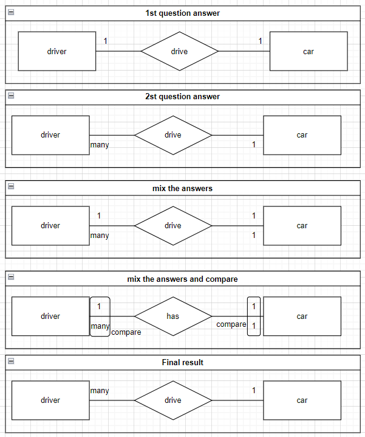  
The cardinality between a weak entity and its corresponding strong entity must be 1 on the side of the strong entity. This is because if a weak entity depended on multiple strong entities, then deleting one instance of the strong entity would not necessarily require deleting the related weak entity instances. In that case, the entity would no longer truly be "weak" — it would act as a strong entity.

###### One to Many
When many instances of one entity can or must be associated with many instances of another entity.

**Example:**  
Business has cars and drivers, and any driver can drive any car...  
> To know what the cardinality is in this relation, we ask ourselves 2 questions and get 4 values.
> *First question is*: How many cars, one employee can drive?
> *First question answer*: **1** employee can drive **many** cars.
> *Second question is*: How many employees can drive the same car?
> *Second quesion answer*: **1** car can be drived by **many** employee.
> Now we take the 1st quantity of the 1st answer and compare it with 2nd quantity of the 2nd answer.
> So we will compar **1** with **many**, and this will give me *many*.
> Then we take the 2nd quantity of the 1st answer and compare it with 1st quantity of the 2nd answer.
> So we will compare **many** with **1**, and this will give me *many*.  
[Example Diagram for the solution with the steps](./design/many-to-many-cardinality.drawio)  
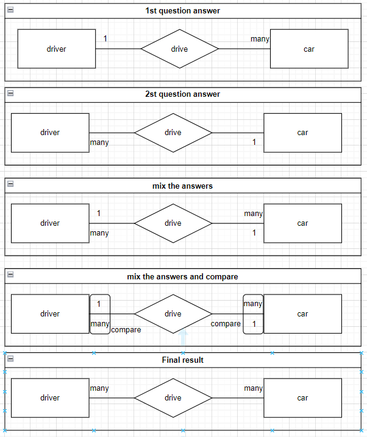  

#### Participation Constraint
It tells whether every entity must participate in a relationship, or it may or may not participate.

##### Total Participation
It tells every entity that must participate in a relationship.

###### Example
A business employee must work for a department...  
[Example Diagram](./design/total-participant-relationship.drawio)  
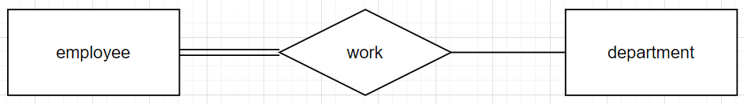  

*Note:* **Weak entity** always has a *total participation*; because it fully dependent on **strong entity**. I mean that every record in **weak entity** must have a relation with a record in the **strong entity**.  

##### Partial Participation
It tells whether every entity may or may not participate in a relationship.  

###### Example
A business client may rent a car...  
[Example Diagram](./design/partial-participant-relationship.drawio)  
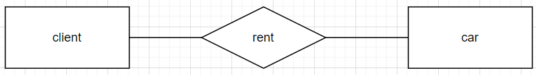  