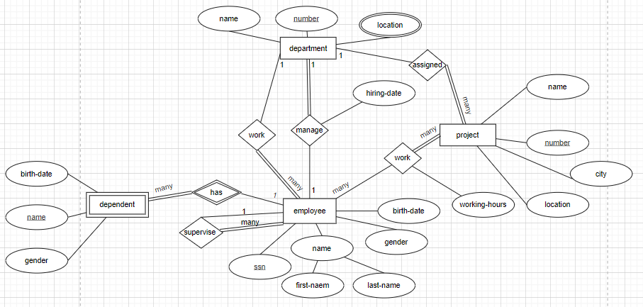

# Example of ERD

## Requirement document
- The company has a number of employee each employee has SSN, Birth Date, Gender and Name which represented as Fname and Lname.
- The company has a set of departments each department has a set of attributes DName, DNum (unique) and locations.
- Employees work in several projects each project has Pname, PNumber as an identifier, Locatin and City.
- Each employee may have a set of dependent: each dependent has Dependent Name (unique), Gender, and Birth Date. (Note: If the employee left the componey no needs to store their dependents info)
- For each Department, there is always one employee assigned to manage that department and each manager has a hiring Date.
- Department may have employees but employee must work on Only One department.
- Each department may have a set of projects and each project must assigned to one department.
- Employees work in several projects and each project has several employees and each employee has a number of working hours in each project.
- Each employee has a supervisor.

## Steps I do follow to draw the ERD
1. Provide a tool to document my questions that I need clarify for from the **System analyest**.
2. Draw *weak* and *strong* entities. and for *weak* entities I will draw the relation *participation* with the *strong entity*.
3. Draw the attributes of each entity, accourding to the attribute type.
4. Idintify the **key** of each **entity**, and edit the attributes drawign according to the **key** type.
5. Draw the relation between entities. I will go through this step in several stages:
    1. Draw the relation name between entites accourding to the relation **degree** and name it.
    2. Draw the attributes of the relations, accourding to attribute type.
    3. Draw the participation constraint of every relatinship.
    4. Draw the cardinality of every relationship.
## My answer:

### Questions to the **System analyst**:
- If an department is canceled, are the employee worked on will be fired?! (Answer: **no**)
- If an project is canceled, are the employees will assigned to the project will be fired? (Answer: **no**)
- What is the meaning that the department has *locations*, and is that mean that the department has many locations? (Answer: ..., yes department may has many locations)
- Is a *city* attribute is a part of a *location* attribute in *project* entity? (Answer: No city is a seperated attribute, and the location is the location of the poroject inside the city.)
- For the scentence: `Each employee has a supervisor`. is the employee must has a supervisor?! (Answer: **yes**)
- Is it must to the project to be worked on by employee?! (Answer: **yes**)
- Is it must for the employee to work on a project?! (Answer: **no**)
- Can the *depndent* be depend on more than one *employee*. For example 2 husbends have a child, the both husbends are employee in the compony, so can the *child* be depend on boty? (Answer: **no**)
- Can one *employee* manage many departmetns? (Answer: **no**)
- Can one *supervisor* supervise many *employee*? (Answer: **yes**)

### Answers:
[ERD](./example-answer.drawio)  
