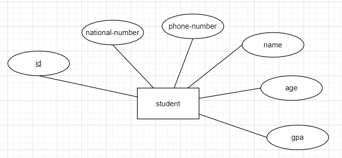
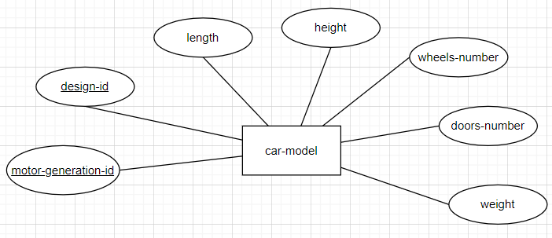

# Keys in DB
## Key
Is an attribute (or a set of attributes) used to uniquely identify an instance of an entity , or to create and manage relationships between entities.

## Types
### Candidate key
It's a possible **primary key** (attribute that have a not-null unique value for each instance of the entity).
#### Example
Our System has students, each one of them has id, national-number, phon-number, name, age, and GPA. All of these attributes can't has null value. and the id, national-number, and phone-number every on of them is unique value.

The candidate key is an attribut can be a **primary key**; So in our context we have 3 **candidate keys**: id, national-number, and phone-number.

### Primary key (PR)
- Is an attribute that have a not-null unique value for each instance of the entity.  
- For each entity you choose just one **key** of the **candidate keys** to be a **primary key**.  

**Diagram shape**: Undrline drawen under the name of the attribute the represent the **primary key**.  

#### How to choose the *Primary key* from *candidate keys*?
There is 2 important charactaristics:
1. Choose keys that do not change (stable keys).
2. Choose integeral keys than string(txt) keys.
3. Choose shorter keys than longer keys.
*Note:* These charctaristics is like a filter, firstly you filter the keys with the 1st charchtaristic and then with the seconed. Then you will get powrful **primary key**.

#### Example
Our System has students, each one of them has id(lengeth 10 integers), national-number (length 14 chars), phon-number(length 11 integers), name(max 20 chars), age (from 17 to 120), and GPA (from 0 to 4). All of these attributes can't has null value. and the id, national-number, and phone-number every on of them is unique value.  

From the example before we exptract the **Candidate keys**:
- id -> length 10 integers
- national-number -> length 14 chars
- phon-number -> length 11 integers

To choose the Primary key we need firstly `Choose keys that do not change`; so we have now:
- id -> length 10 integers
- national-number -> length 14 chars
We get red of the *phone-number* because student can change it.

Then secondly `Choose integeral keys than string(txt) keys`; so now our **primary key** is: ***id***.
We get red of the *national-number* because it stored as **string** not **integer**.

If we has still more keys we can  complete, but now we just have ***id*** as a good possible **PK**.
[Example Diagram](./design/primary-key.drawio)  

### Partial key 
It's a **pinary key** of a **weak entity**.

### Composite key
- It's a compination of not-null valued attributes, that the compination of these values is unique for each instance of the entity.
- We use this type of keys, when we don't have any **candidate key**.

**Diagram shape**: Undrline drawen under the name of the attributes that represent the **composite key**.  

#### Example
Our factory has cars models, each car model contain design-id, motor-generation-id, doors-number, wheels-number, length, height and weight. It's possible to have more than one model with the same design-id, and more than one model with the same motor-generation-id, but it's not possible to have 2 cars models with the same compination of design-id and motor-generation-id. And all attributes must not have null value.

For the car-model entity I need to extract the **candidate keys** and then filter them to get the **primary key**, but my problem that all attributes can be dublicated, so there no one attribute can have a unique value for each instance of the *car-model* entity; So we now can search for a **Composite key**.  
From the description you see this scentence: `it's not possible to have 2 cars models with the same compination of design-id and motor-generation-id` and this `all attributes must not have null value`. This mean the the compination of *desing-id* and *motor-generation-id* attributes are unique, and no one of them can be **null value**.  
So our **key** her is a **composite key**, It's a compination of these 2 attributes: *desing-id* and *motor-generation-id*.

[Example Diagram](./design/composite-key.drawio)  
  
*Note:* If you don't have **candidate keys** or **composite key** you can make your out **Primary key** and add it as attribute, and this what we called `Artifitial key`.

### Artifitial key
Is a not-null, unique-valued attribute that is added to the entity for identification purposes. It is not naturally a part of the entity's real-world data, has no business meaning, and usually acts as the primary key.

### Foreign key
### Alternate key
### Super key
### Nature key